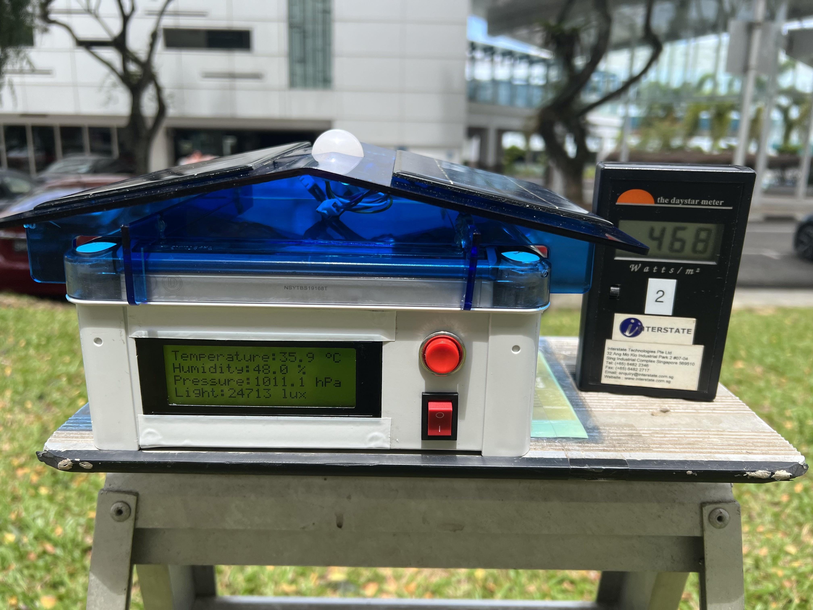
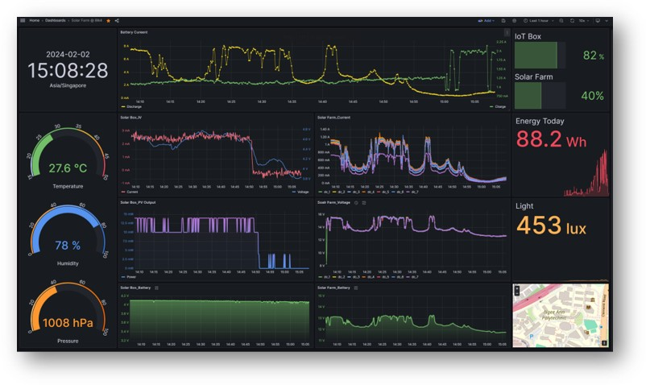
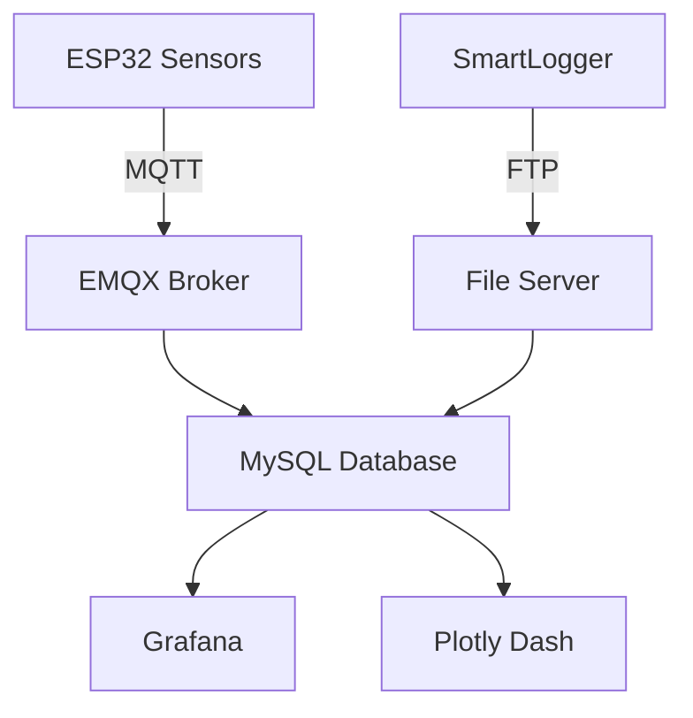

# Distributed IoT & Performance Analytics for PV System

 

## 📊 Project Overview
This project focuses on developing a distributed IoT system to monitor and analyze the performance of solar panel installations. 
The system collects comprehensive data from solar plants, stores it in a local SQL database, and visualizes the data through interactive dashboards.

## 🔍 Project Objectives
- Develop IoT-based solar monitoring system
- Collect environmental/electrical data
- Implement predictive analytics
- Create visualization dashboards

## 🌱 System Architecture

## 🛠️ Hardware Components
- ESP32-WROOM-32 >> Main microcontroller
- BH1750 >> Light intensity
- INA219 >> Current/power monitoring
- DHT11 >> Humidity and Temperature Sensor
- BME280 >> Ambient Pressure Sensor
- DS1307 >> RTC module
- LCD2004 >> LCD Display
- NCR18650B	>> Battery power
- 2*2W Solar Panel >> 4W Renewable charging

## 🚀 Solution Architecture
**Three-Tier System:**
1. **Edge Layer**  
   - ESP32-based sensor nodes (15+ parameters)  
   - Solar-powered with battery backup  
   - Adaptive sleep cycles (60% power reduction)

2. **Data Layer**  
   - Hybrid MQTT/FTP data collection  
   - Time-series SQL database (3+ years historical data)  
   - Automated data cleaning pipeline

3. **Analytics Layer**  
   - Real-time Grafana dashboards  
   - Predictive ML models (85% accuracy)  
   - Fault detection algorithms

## 🌟 Unique Features
- Self-sustaining nodes with solar charging
- Hybrid connectivity (WiFi/4G fallback)
- Modular PCB design for easy maintenance
- Time-synced data across distributed nodes
- Two-tier alert system (email/API)

## 🔮 Future Roadmap
- Integration with campus EMS
- Blockchain-based data verification
- Digital twin simulation
- Autonomous cleaning system triggers
