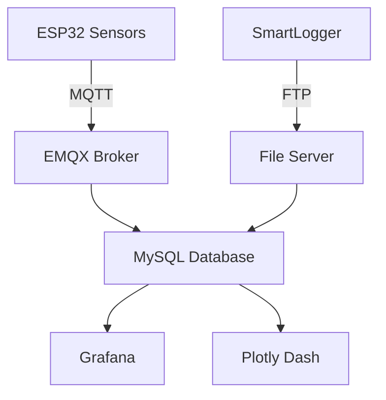

# Distributed IoT & Performance Analytics for PV System

## Project Overview
This project focuses on developing a distributed IoT system to monitor and analyze the performance of solar panel installations. 
The system collects comprehensive data from solar plants, stores it in a local SQL database, and visualizes the data through interactive dashboards.

## Project Objectives
- Develop IoT-based solar monitoring system
- Collect environmental/electrical data
- Implement predictive analytics
- Create visualization dashboards

## System Architecture

## Hardware Components
- ESP32-WROOM-32 >> Main microcontroller
- BH1750 >> Light intensity
- INA219 >> Current/power monitoring
- NCR18650B	>> Battery power
- 2W Solar Panel >> Renewable charging

## Data Flow
Sensors → ESP32 (I2C) → MQTT Broker (Wi-Fi) → MySQL Database → Visualization Tools

- ESP32 Devices:

Collect sensor data and transmit via MQTT to the broker.
Enter deep sleep mode to conserve power when inactive.

- SmartLogger:

Logs data from inverters and power meters via RS485.
Transfers data to FTP server for backup.

- MQTT Broker (EMQX):

Aggregates data and forwards it to the MySQL database.

- Database:

Stores structured data for analysis.

- Visualization:

Grafana pulls data from MySQL for real-time monitoring.
Plotly Dash provides interactive analytics.

